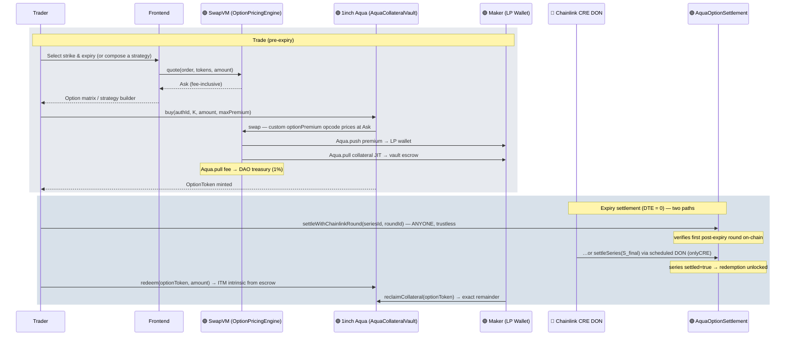
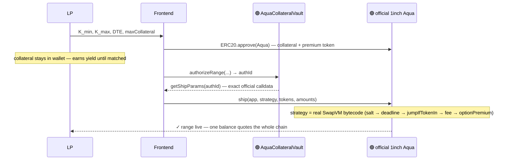
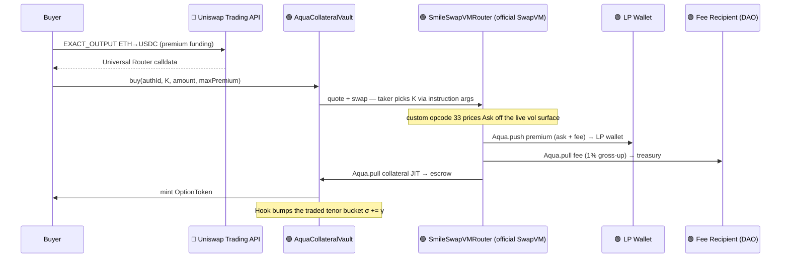
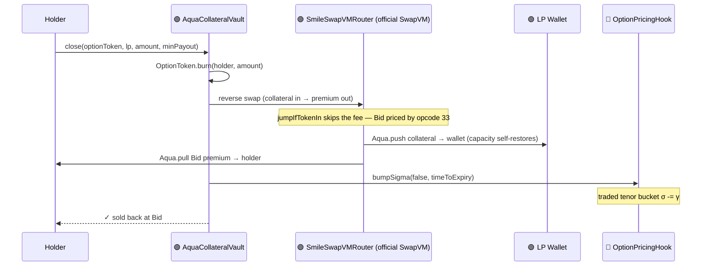
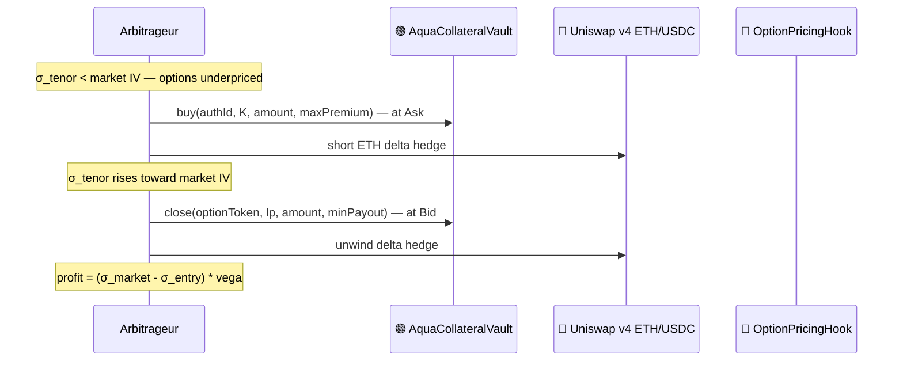
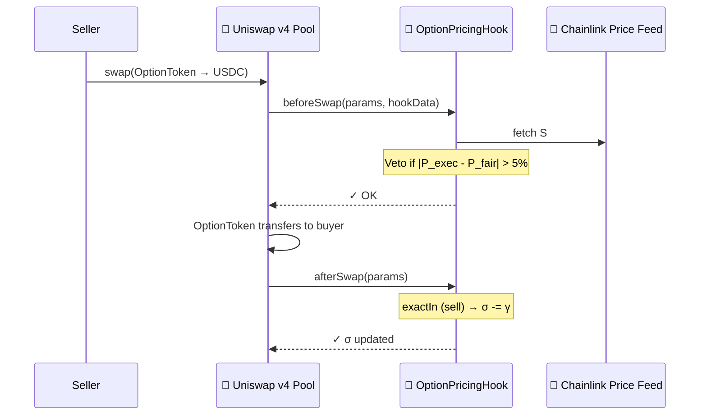
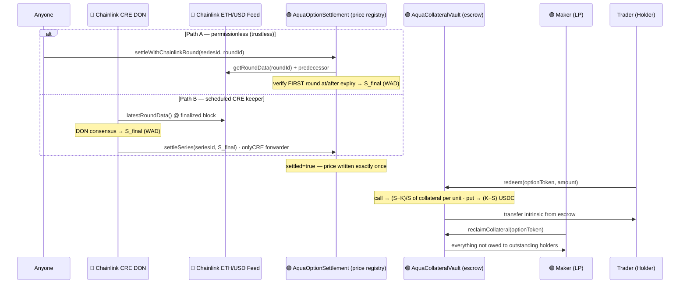
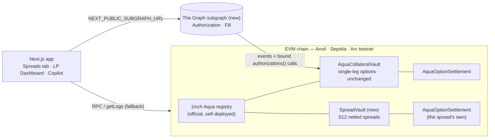
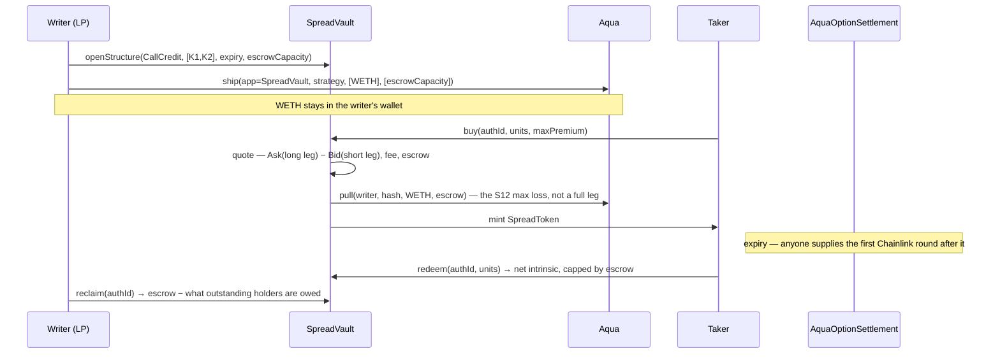

# Smile

TL;DR: Standard options market potentially as popular as Robinhood, decentralized as Polymarket.

A non-custodial, parametric options marketplace that solves three interlocking problems in DeFi options: thin liquidity at each strike, yield-killing collateral lock-up, and the absence of emergent market makers. By combining **1inch Aqua**, **Uniswap v4 Hooks**, and **Chainlink CRE**, LPs can quote an entire strike range from one capital pool — while their collateral keeps earning DeFi yield until a buyer actually matches.

---

## Table of Contents

1. [The Thesis](#-the-thesis)
2. [Architecture](#%EF%B8%8F-architecture)
3. [Mathematical Specification](#-mathematical-specification)
4. [Flow Diagrams](#-flow-diagrams)
5. [Deployed Addresses (Sepolia)](#-deployed-addresses-sepolia)
6. [How to Run the Project](#%EF%B8%8F-how-to-run-the-project)
7. [End-to-End Demo Walkthrough](#end-to-end-demo-walkthrough)
8. [Glossary](#-glossary)
9. [Project Structure](#%EF%B8%8F-project-structure)
10. [EthOnline 2026 — Continuation Track](#-ethonline-2026--continuation-track)
11. [Technical Stack](#technical-stack)

**Live:** [smile-frontend-omega.vercel.app](https://smile-frontend-omega.vercel.app) — the full app with the AI copilot (server build, Sepolia + Arc) · [oslinin.github.io/Smile](https://oslinin.github.io/Smile/) — static build (no copilot) · [help site](https://smile-frontend-omega.vercel.app/help.html)

More docs: [build notes & war stories](docs/build-notes.md) ·
[verified CRE simulation transcript](docs/cre-simulation.md) ·
[known limitations](docs/limitations.md) ·
[solutions & phased roadmap](docs/solutions.md) ·
[reference table — every L/R/S/P, one-liner + status](docs/reference-table.html) ·
sponsor pages — [1inch Aqua](docs/sponsors/aqua.md), [Chainlink](docs/sponsors/chainlink.md), [Uniswap](docs/sponsors/uniswap.md), [The Graph](docs/sponsors/thegraph.md), [Circle · Arc](docs/sponsors/arc.md), [Frontend](docs/sponsors/frontend.md)

> This README is also published as a wiki-style help page — with a sidebar
> linking Overview (this doc), Limitations, Solutions, and the Reference
> Table — at `/help.html` in the deployed frontend, generated from these same
> files by `frontend/scripts/gen-help.mjs`.

---

## 🚀 The Thesis

While prediction markets — binary options on event outcomes — have been widely successful in DeFi (Polymarket, Augur), standard options have not. Prediction markets do not offer many strategies retail traders have been increasingly investing in: selling covered calls to generate yield on held ETH, selling cash-secured puts to acquire ETH at a discount, buying butterflies to express a range-bound view on volatility, etc. The building blocks for this popular market requires a functioning options market with real liquidity across strikes and expiries for standard options (buys and sells of puts and calls). That market has never materialized on-chain: Ribbon and Friktion pioneered DeFi Options Vaults (DOVs) but suffer from trapped liquidity: collateral is locked per strike chosen by the vault manager, leaving the rest of the chain empty. Premia introduced RFQ-based pricing that relies on institutional market makers for quotes, creating a dependency on off-chain liquidity.

Smile attempts to overcome these limitations to on-chain standard opions trading by using Aqua's non-custodial LP to remediate:

1. Liquidity fragmentation across strikes and expiries, until a buyer is matched. Makers can offer liquidity across a range of strikes and expiries, increasing net liquidity.
2. Collateral lockup in LPs, and forfeited dividend yield — which is not a limitation of standard options writers — is also removed by Aqua's non-custodial LP.
3. Standard options markets work because broker-dealers delta-hedge their books against the spot market. Smile attempts to use the trading and settlement functionality provided by Uniswap and Chainlink to allow clever LPs and arbitrageurs to continuously arbitraging away mispricings between options and the underlying. Specifically:
   - Fast trading and premium transfer via Uniswap Trading API
   - Vol surface repricing post-trade via Uniswap v4 Hooks across strikes and expiries
   - Options payoff settlement and redemption via Chainlink CRE

### Competitive positioning: why not Panoptic?

[Panoptic](https://panoptic.xyz) is the strongest live on-chain options design and
deserves a direct answer. It synthesizes **perpetual** options out of Uniswap v3 LP
positions and prices them off the pool's realized fee flow ("streamia") — which
elegantly deletes the pricing-oracle problem altogether. But that design does not
target — and structurally *cannot* target — the user Smile is built for: the
**OptionStrat/thetagang-style premium seller** and the **Deribit-style vanilla
trader**.

- **No expiries.** Panoptic options are perpetual — there is no "March 3,500 call,"
  no expire-worthless endgame where the seller keeps the credit, and no calendar or
  diagonal spreads (there is no term structure to spread across). Smile's fixed
  European expiries and per-tenor vol buckets quote all of these natively.
- **No upfront credit.** A Panoptic "put credit spread" or "iron condor" draws the
  same payoff diagram but streams income only while spot sits near the short
  strikes — the premium is path-dependent and unknowable at entry. A Smile seller
  collects a known premium at fill, priced off *implied* vol, which charges for jump
  risk upfront; realized fee flow does not.
- **Liquidations exist.** Panoptic runs partial collateral with margin and forced
  liquidations (plus forced exercise of far-OTM longs). Smile is fully
  collateralized by construction — an option, once written, can always pay.

Smile makes the opposite bet: keep the instrument traders already know —
fixed-expiry, cash-settled European vanillas with known premiums — and rebuild the
**market-making stack** around it to compete with Deribit and tradfi desks on their
own terms:

- **1inch Aqua** removes the market maker's largest on-chain cost. Collateral stays
  in the LP's wallet, earning yield, until the moment of sale — so quoting an entire
  strike chain is nearly free, a yield double-dip no tradfi desk or locked vault
  gets.
- **SwapVM pricing + LP-quoted vol** lets each LP express their own σ per range —
  quoting *in vol*, exactly how professional desks quote — and best-quote routing
  turns overlapping ranges into an order book in vol space, so the touch is the
  discovered market vol.
- **Uniswap v4 hooks** reprice the surface with flow, and tradfi-grade spread
  mechanics — staleness-scaled spreads, size-convex price impact, per-block notional
  caps, a spread floor calibrated to the oracle's blind window — price adverse
  selection the way a desk does instead of pretending it away (see
  [docs/limitations.md](docs/limitations.md) and
  [docs/solutions.md](docs/solutions.md)).
- **Chainlink settlement** is permissionless and round-verified, and LPs who want
  the full tradfi profile can delta-hedge from the same wallet that backs their
  quotes — the collateral never left it.

In short: Panoptic reinvents the option to fit Uniswap; Smile keeps the option
traders already trade and uses Aqua, SwapVM, Uniswap hooks, and Chainlink to rebuild
how it's made.

---

## 🏗️ Architecture

| Layer          | Component                                     | Functionality                                                                                                                                                                                                                    |
| :------------- | :-------------------------------------------- | :------------------------------------------------------------------------------------------------------------------------------------------------------------------------------------------------------------------------------- |
| **Pricing**    | `SmileSwapVMRouter` + `OptionPricingEngine`   | Custom instruction (opcode 33) on the **official 1inch SwapVM** pricing off a **multiparameter vol surface**: σ per tenor bucket + skew, $\sigma_{strike} = \sigma_{tenor} \cdot (1 + \alpha \cdot \ln(K/S)^2 + \beta \cdot \ln(K/S))$, time-value $= S \cdot \sigma_{strike} \cdot \sqrt{T}$. The instruction is **two-sided**: forward direction prices the Ask, reverse the Bid. Oracle reads enforce Chainlink freshness. |
| **Liquidity**  | **official 1inch `Aqua`** + `AquaCollateralVault` | LP calls `authorizeRange(K_{min}, K_{max}, \text{DTE}, \text{maxCollateral})`, then ships the strategy with the official `Aqua.ship()`. On `buy()`, the SwapVM swap `Aqua.push()`es the premium into the LP wallet and `Aqua.pull()`s collateral JIT into escrow. OptionToken deployed lazily per strike. |
| **Market**     | `OptionPricingHook` + **Uniswap Trading API** | The vol surface lives in a Uniswap v4 hook contract: every vault reads `sigmaFor()` to price and calls `bumpSigma()` after each fill (live on every chain). Its v4 entrance — `beforeSwap` vetoes mispriced secondary-market trades, `afterSwap` shifts the whole surface — awaits a live OptionToken pool ([L14](docs/limitations.md)). Trading API used for (1) live ETH/USD spot price and (2) — when `NEXT_PUBLIC_UNISWAP_API_KEY` is set — quoting the buyer's ETH→USDC premium swap (Universal Router, mainnet route) ahead of the vault call; without a key, or on Sepolia/Arc, the buyer pays premium from USDC directly. |
| **Settlement** | `AquaOptionSettlement` + Chainlink CRE        | Every minted series is registered at buy time. At expiry, settlement is **permissionless**: anyone supplies the Chainlink roundId covering expiry and the contract verifies on-chain that it is the first post-expiry round (`settleWithChainlinkRound`) — no trusted writer. The scheduled CRE DON path (`settleSeries`) remains as a keeper. Holders `redeem()` the cash-settled intrinsic from the vault; LPs `reclaimCollateral()` for the exact remainder. |
| **Asset**      | `OptionToken`                                 | ERC-20 option position. Vault is owner, so can burn without allowance. Tradeable on any DEX for secondary-market price discovery.                                                                                                |

### Official 1inch Aqua + SwapVM integration

The liquidity layer runs on the **official contracts** — [`1inch/aqua`](https://github.com/1inch/aqua) and [`1inch/swap-vm`](https://github.com/1inch/swap-vm) (release/1.2), vendored under `lib/` and compiled unmodified:

- **`SmileSwapVMRouter`** (`src/swapvm/SmileSwapVMRouter.sol`) inherits the official `SwapVM` core + `AquaOpcodes` instruction set and registers one custom instruction at **opcode 33**: `_optionPremiumXD`. This router *is* the Aqua app LPs ship to.
- **The strategy is a real SwapVM program**: `salt(authId) → deadline(expiry) → optionPremium(oracle, σ-source, tokens, K-range, expiry, α)` — composed from two official `Controls` instructions plus the custom pricing opcode.
- **The taker picks the strike per swap** via SwapVM taker instruction args, so *one* shipped Aqua balance quotes the **entire option chain** in $[K_{min}, K_{max}]$ — displayed depth is a function of wallet balance, not per-strike pre-allocation.
- **Two-sided market from swap direction**: the forward direction (premium → collateral) prices at **Ask** (rounds against the taker, up); the reverse direction (collateral → premium) prices at **Bid** (rounds down). `close()` executes the reverse swap: the holder is paid the live Bid, the escrowed collateral is `Aqua.push()`ed back into the LP wallet, and the range's JIT capacity **self-restores** — the buyback funded by premiums the LP already earned.
- **Covered calls** execute as official SwapVM swaps (premium `Aqua.push()`ed to the LP wallet, collateral `Aqua.pull()`ed JIT). **Cash-secured puts** use the vault itself as an official `AquaApp` (same JIT `pull()`, under the official per-strategy reentrancy lock) since premium and collateral share one token (USDC).
- **Capacity is enforced by Aqua itself**: over-buying a range underflows the maker's virtual balance inside the official `Aqua.pull()` — the vault keeps no parallel accounting. On a mainnet fork the deploy script reuses the **production Aqua deployment** (`0x4999…6D31`).

### Revenue model (protocol fee via the official fee opcode)

Every option **buy** carries a protocol fee (default 1%, capped at 5%) that accrues to a fee recipient — e.g. the 1inch DAO treasury — routed through the **official SwapVM fee instruction**, not custom plumbing:

- The call-strategy program grows to five instructions: `salt → deadline → jumpIfTokenIn → aquaProtocolFee → optionPremium`. The official `Fee._aquaProtocolFeeAmountInXD` (opcode 28) grosses the fee up **on top of the Ask** — the buyer pays `ask + fee`, the fee recipient is paid through the official `Aqua.pull()`, and **the LP always nets the full premium**.
- The official `Controls._jumpIfTokenIn` (opcode 11) makes fees **direction-aware in bytecode**: sellbacks (collateral-in) jump past the fee instruction, so closing a position is fee-free and never double-charges.
- Puts (the vault-as-AquaApp leg) apply the identical gross-up vault-side.
- Fee terms are **snapshotted per authorization** — an LP sees the exact fee at ship time and it can never change under them; governance changes apply only to new ranges. Fee-enabled ranges ship with $25 of premium-token virtual headroom (an allowance number, no tokens move) because the official opcode pulls the fee before the buyer's premium push lands.

### Collateralization Model

**V1 (current) — Cash-Secured / Covered (Fully Collateralized)**

The simplest and safest model. To mint an ETH Call at a 3,500 strike, the LP backs it with 1 WETH (Covered Call). To mint a Put, the LP backs it with 3,500 USDC (Cash-Secured Put). The collateral is authorized JIT via Aqua — it never leaves the LP's wallet until a buyer matches — but it is always fully present and earmarked.

Solvency is trivially guaranteed: if the option expires in-the-money, the locked assets are delivered to the buyer. No price oracle is needed for margining and no liquidation engine exists — there is nothing to liquidate.

**What V1 can do — because the premium is a deterministic on-chain function of (spot, strike, T, σ):**

| Capability | Why the mechanism allows it |
|---|---|
| Known upfront premium, fixed European expiry | Computable at click time from the surface — the instrument OptionStrat sellers actually trade |
| Sell covered calls **and** cash-secured puts | Full collateral makes writing safe with zero margin machinery |
| Buy calls & puts at any strike in a range | Taker picks the strike per swap; one Aqua balance quotes the whole chain |
| Exit anytime at a live Bid | The same strategy quotes both sides — no counterparty search to close |
| Calendars & diagonals | Fixed expiries + per-tenor σ buckets give a real term structure |
| Vol competition | LPs quote their own σ multiplier; `bestQuote` routes to the touch (S5/S6) |
| Trustless settlement, ERC-20 positions | Chainlink-round-verified expiry price; options compose anywhere |
| Free quoting | The entire pricing path is `view` — scanning every range costs nothing |

**What V1 cannot do — and the mechanism's root cause for each:**

| Gap | Root cause |
|---|---|
| Know its vol is right without trades | σ only moves on fills; an untraded range quotes yesterday's vol ([L6/L7](docs/limitations.md), S7 is the fix) |
| Avoid paying informed flow | Quotes derive from a lagging oracle; adverse selection is *priced* (R1–R5), never eliminated ([L1/L2/L5](docs/limitations.md)) |
| Capital-efficient short legs | A spread's short leg posts full collateral as if naked until S12 netting — condors work but are capital-hungry |
| Naked writing | No mark, no liquidations — that is the entire V2 ladder below |
| Assets without a price feed | The mechanism needs external spot; long-tail listings are feed-constrained (S11) |
| Exact Black-Scholes prices | The on-chain formula deliberately omits N(d₁)/N(d₂) — gas-cheap, roughest deep-ITM and near expiry |

**Versus the Uniswap mechanism (Panoptic)** — really *oracle-quoted implied vol* vs *pool-realized fee flow*:

| | Smile: surface + oracle | Panoptic: Uniswap LP synthesis |
|---|---|---|
| Premium known at entry | ✔ fixed, upfront | ✘ streams while spot sits near strike; path-dependent |
| Seller paid for jump risk | ✔ implied vol charges upfront | ✘ paid realized fees; gaps deliver loss with no premium |
| Expiries / calendars / expire-worthless | ✔ native | ✘ structurally impossible (perpetual) |
| Pricing-oracle risk | ✘ inherent — priced by spreads | ✔ none — its genuine win |
| Vol staleness in quiet markets | ✘ σ waits for a trade | ✔ n/a — no vol model at all |
| Asset universe | Needs a feed | Any Uniswap v3 pool |
| Solvency | Guaranteed, no liquidations | Margined: liquidations + forced exercise |
| Capital efficiency today | Low until S12 | Higher (partial collateral on spreads) |

One line: **Smile's mechanism trades oracle risk for a real options contract; Uniswap's trades the contract for freedom from oracles.** Smile can state a price and a date and guarantee payment, at the cost of defending a lagging oracle and a trade-gated vol surface; Panoptic never has a wrong oracle price, at the cost of never telling you what your hedge costs or when it ends.

**V2 (designed, deliberately deferred) — The capital-efficiency ladder**

The obvious V2 question is *"when do we allow uncovered calls?"* — and the answer
starts by untangling two things that usually get conflated: **margin is what
protects the protocol; delta hedging is what protects the maker.** No exchange
mandates hedging — Deribit and the CME require margin and mark to market, full
stop — but at the 5–20× leverage naked writing implies, an unhedged directional
book has near-certain ruin, so in practice every surviving naked writer hedges.
A margined V2 therefore *implies* a delta-hedged maker base even though the
contracts never enforce it. The right design lever is to **recognize** hedges
rather than require them: portfolio margin that nets a short call against long
WETH (rediscovering today's covered call as the zero-extra-margin case), spreads
against each other, and — the step that quietly forces a perp integration, as
Derive's cross-margin account shows — an on-venue hedge leg the vault can
actually see. A hedge on a CEX is invisible to the contract and can reduce
nothing.

Full margin is also not one feature but a five-part machine, and the price list
deserves to be stated in advance:

1. **A mark for every open option** — margin is `collateral ≥ k × current
   liability`, which needs a continuously updated fair value, i.e. an IV oracle.
   Circular for a venue whose purpose is to *discover* IV; dependent if imported
   from Deribit.
2. **A liquidation engine + keeper network** — bots that buy back or auction
   positions when maintenance margin breaks.
3. **A liquid market to liquidate *into*** — the forgotten constraint.
   Liquidating a short call means *buying that call back* at the worst moment;
   on a thin book the engine has no counterparty. Naked margin is only safe
   *after* the venue is liquid — it can never be what bootstraps liquidity.
4. **An insurance fund** — crypto gaps faster than liquidations land; bad debt
   is a *when*, not an *if*, and someone must eat it.
5. **Sub-second-grade price feeds** for the margin marks.

Because each part is expensive and the last three import exactly the risks V1
was built to exclude, V2 is sequenced as a ladder — each rung captures capital
efficiency *without* paying for machinery the rung below didn't need:

| Rung | Mechanism | Liquidation machinery | Who it serves |
|---|---|---|---|
| 1 | **Yield-bearing collateral** ([S4](docs/solutions.md)) — escrowed wstETH/sDAI keeps earning while backing quotes | None | Every LP: makes full collateral *cheap* instead of smaller |
| 2 | **Defined-risk netting** ([S12](docs/solutions.md)) — **implemented at EthOnline 2026 as `SpreadVault`** (see the Continuation Track section below): a call spread margined at its true max loss `(K₂−K₁)/K₂` WETH, not naked-per-leg | None — pure position accounting | The spread/condor seller (the core Smile user) |
| 3 | **Partial-collateral puts** — **implemented at EthOnline 2026 as `MarginVault`** ([S13](docs/solutions.md), opt-in, puts only): initial margin `min(K, intrinsic + 50% of the worst-of-hour Chainlink mark)`, maintenance at 30%, margin call → takeover auction → backstop pool → insurance → (haircut, loudly) | Light — bounded bad debt, see [L13](docs/limitations.md) | Yield-focused put writers |
| 4 | **Naked calls + cross-margin** — unbounded liability, the full five-part machine; MarginVault's waterfall is the machine, calls follow once a WETH shortfall can be paid | All of it | Professional delta-hedging desks |

Rungs 1–3 preserve the property that is Smile's one absolute differentiator
against Derive, Panoptic, and Deribit alike: **an option, once written, can
always pay.** Rung 4 breaks it — so rung 4 stays gated behind evidence that
rungs 1–3 left real demand unmet, and its natural constituency (professional
makers who hedge in milliseconds) may be better served by the signed-quote RFQ
tier ([limitations.md R6](docs/limitations.md)), where pros manage their own
leverage off-chain and the trustless vault never underwrites it.

---

## 📐 Mathematical Specification

### 1. Multiparameter Volatility Surface

$$\sigma_{strike}(T) = \sigma_{tenor}(T) \cdot \max\!\big(0.1,\; 1 + \alpha \cdot \ln(K/S)^2 + \beta \cdot \ln(K/S)\big)$$

- $\sigma_{tenor}(T)$: demand-driven IV stored **per tenor bucket** — $[0,7d)$, $[7,30d)$, $[30,90d)$, $[90d,\infty)$ — the term structure of the surface (`OptionPricingHook.sigmaFor`).
- $\alpha$: smile curvature (default 2.0). OTM/ITM strikes price above the tenor σ; ATM returns it exactly.
- $\beta$: signed **skew** tilt (default 0; negative = downside/put skew, matching empirical crypto markets).
- The multiplier is floored at 0.1 so deep wings can never collapse σ to zero.

**Reading the surface like a trader.** The (σ, α, β) triple is exactly the *level / skew / curvature* decomposition options desks have always used, so it translates one-for-one into the three numbers vol traders quote each other — no new model, no new Greeks, just the standard dictionary:

| Parameter | Trader's name | Plain English | Approximate conversion* |
|---|---|---|---|
| $\sigma_{tenor}$ | **ATM vol** | The price of movement itself, regardless of direction. Multiply by $\sqrt{T}$ for the **expected move** by expiry — the drift the premium is charging for. | identical |
| $\beta$ (skew) | **25Δ risk reversal (RR)** | Which *direction* costs more. Negative = crash insurance is pricier than upside (typical for equities/crypto). | $RR \approx 2\,\sigma_{tenor}\,\beta\,k_{25}$ |
| $\alpha$ (curvature) | **25Δ butterfly (BF)** | How much *extra* a big move costs vs a small one — the market's fat-tails charge over a perfect bell curve. | $BF \approx \sigma_{tenor}\,\alpha\,k_{25}^2$ |

*where $k_{25} = \lvert\ln(K_{25\Delta}/S)\rvert$, the log-moneyness of the "25-delta" reference strikes — the OTM call and put with ~25% probability of finishing in the money, the near-universal convention for measuring the wings. The frontend computes RR/BF exactly (evaluating the smile at the true 25Δ strikes — `surfaceQuotes` in `frontend/lib/options.ts`) and shows them in the One-Click Income panel with plain-language captions.

Two things this framing buys: **(1) takers** get a sanity check in familiar units — an expected-move band instead of an abstract α; **(2) LPs** see their [L6](docs/limitations.md) surface-parameter risk in the same terms a Deribit market-maker manages daily — vega against the ATM level, RR-sensitivity against the skew, fly against the curvature — rather than as bespoke protocol exposures. (Client-facing greeks are untouched: takers always see plain Black-Scholes delta/gamma/theta/vega evaluated *at* the smile σ, whatever parameterization produces it.)

### 2. Premium Calculation

$$P = \underbrace{\max(\pm(S - K),\, 0)}_{\text{intrinsic (call/put)}} + \underbrace{S \cdot \sigma_{strike} \cdot \sqrt{T} \cdot \tfrac{\min(S,K)}{\max(S,K)}}_{\text{moneyness-damped time-value}}$$

- **Ask** (forward swap direction, opening): rounds against the taker (up).
- **Bid** (reverse direction, sellback): rounds down. One strategy quotes both sides; the rounding asymmetry is the spread engine.
- A protocol fee (default 1%) is grossed up **on top of** the Ask via the official SwapVM fee opcode — the LP always nets the full premium. Sellbacks are fee-free.

Gas-efficient on-chain approximation — omits $N(d_1)$ and $N(d_2)$ to avoid square-root-heavy distributions.

### 3. σ Feedback Loop (tenor-aware)

$$\sigma_{tenor,\,t+1} = \sigma_{tenor,\,t} + \gamma \cdot \text{sign}(\text{trade})$$

- $+\gamma$ on every `buy()` — bumps **only the traded tenor bucket**.
- $-\gamma$ on every `close()` sellback — decays the same bucket.
- Uniswap v4 `afterSwap` (no tenor info) shifts the whole surface.
- $\gamma = 0.5\%$ per trade. This creates a price-impact-like mechanism: heavy buying steepens the surface and raises premiums, attracting arbitrageurs who sell back to earn the spread.

> **Design note — why pricing is on-chain, and why $\sigma_{tenor}$ is a step function.**
> `OptionPricingHook.sigmaFor` is read **atomically inside the same swap** that buys or
> sells the option, so the price a trader gets is exactly whatever the bucket lookup
> returns at that block — no off-chain quote to go stale or be front-run. This isn't
> architecturally required: `AquaOptionSettlement` already sources its *expiry* price
> off-chain via the Chainlink CRE forwarder (§5), so an RFQ-style premium quote (a
> signed off-chain price, verified on-chain much like a CRE report) is possible in
> principle. The tradeoff:
> - **On-chain step lookup (current):** fully permissionless and atomic, no quoting
>   service to keep live — but $\sigma_{tenor}(T)$ is discontinuous at the 7d/30d/90d
>   bucket edges (visible as terraces on the Vol Surface tab), and each trade can only
>   afford to move the one bucket it landed in.
> - **Off-chain quoted pricing:** could interpolate $\sigma_{tenor}(T)$ smoothly across
>   tenors, but reintroduces a liveness/trust dependency on the quoter, and blending a
>   trade's demand feedback across neighboring buckets (instead of bumping one bucket)
>   opens a manipulation surface — trading right at a bucket edge could nudge a bucket
>   nothing actually traded in.
>
> V1 keeps pricing on-chain and discrete; smooth interpolation is left for a future
> RFQ-style quoting layer.

### 4. Black-Scholes Delta (Frontend)

Delta ($\Delta$) is computed client-side for the matrix display. Not used in on-chain pricing.

$$\Delta = N(d_1), \qquad d_1 = \frac{\ln(S/K) + \frac{1}{2}\sigma_{strike}^2 \cdot T}{\sigma_{strike} \cdot \sqrt{T}}$$

$N(\cdot)$ is approximated via Abramowitz & Stegun 26.2.17 (max error $1.5 \times 10^{-7}$, no lookup tables). $\sigma_{strike}$ from §1 is used — ensuring delta reflects the vol surface curvature, not flat vol.

> Delta ranges 0–1 for calls (0 = deep OTM, 1 = deep ITM). A 0.5-delta call is approximately ATM.

### 5. Expiry Settlement — Permissionless + Chainlink CRE

A parametric option is only as trustworthy as the price it settles against. At expiry every open series needs one **final spot price** $S_{final}$ written on-chain, because that single number decides every payout: holders redeem the in-the-money intrinsic and the LP reclaims the remainder (see [§6 flow](#6-settlement--redemption)). Every series is registered with `AquaOptionSettlement` at first mint, and can then be settled by **either of two paths**:

**Path A — permissionless Chainlink-round settlement (trustless).** Anyone — a keeper, the holder, the LP — calls `settleWithChainlinkRound(seriesId, roundId)` with the Chainlink ETH/USD round covering expiry. The contract verifies on-chain that the round was updated **at/after expiry** and that its predecessor was updated **before** expiry (i.e. it is the *first* post-expiry round), so nobody can cherry-pick a later, more favorable price:

$$S_{final} = \mathtt{getRoundData(roundId).answer} \;\; (\text{8-dec}) \;\rightarrow\; \text{WAD 18-dec}$$

No trusted writer exists on this path — settlement liveness reduces to the feed's.

**Path B — Chainlink CRE (scheduled keeper).** A CRE *cron trigger* fires the settlement workflow at expiry: the DON reads the same aggregator at the last *finalized* block (every node observes an identical value), reaches consensus, and the DON-signed report calls `settleSeries(seriesId, S_final)` through the CRE forwarder — so a series settles on schedule even if nobody races to call Path A.

In short: 1inch Aqua holds the collateral, Uniswap prices and routes the trade, and settlement is **available trustlessly to anyone** with Chainlink CRE as the scheduled closer.

> **Design note.** Because both paths resolve to the on-chain Chainlink feed, the DON's role is a *scheduled, trust-minimized keeper* (deterministic read + signed write) rather than novel off-chain data sourcing.

### 6. Quoting Oracle — Chainlink Data Feeds, with an Optional Pyth Pull-Oracle

Settlement (§5 above) always resolves through Chainlink's on-chain round
history — that's what makes permissionless expiry-bracketing verifiable, and
it never changes. **Quoting** (pricing a live `buy()`/`close()`) is a
separate concern and reads whatever `IPriceOracle` the vault was deployed
with:

- **Default — Chainlink Data Feeds.** `OptionPremiumInstruction` and the
  vault's put-pricing path call `latestRoundData()` directly, gated by a
  `maxStalenessSec` freshness check. This is a **push** oracle: the price is
  only as fresh as Chainlink's last heartbeat/deviation-triggered update,
  which is the root cause of the oracle-latency gap documented as
  [L1/L2 in docs/limitations.md](docs/limitations.md) (stale-quote sniping,
  and an "invisible window" of sub-threshold drift with no on-chain signal
  at all).
- **Optional — `PythSpotAdapter` pull-oracle.** [Pyth](https://pyth.network)
  is a first-party oracle: 100+ trading firms and exchanges submit price +
  confidence directly, aggregated into an update roughly every 400ms. It's a
  **pull** oracle — the taker fetches a signed update off-chain and posts it
  in their own transaction (`PythSpotAdapter.refresh()`), so the very next
  read in that transaction prices against a near-live spot instead of
  Chainlink's last published round. `PythSpotAdapter.sol` wraps this behind
  the same `latestRoundData()` shape the pricing path already expects (round
  ids are meaningless for a pull oracle and returned as zero;
  `updatedAt` maps to Pyth's `publishTime`), so swapping it in requires no
  changes to `OptionPremiumInstruction` or the vault. Scope is **quoting
  only** — settlement is untouched and still reads Chainlink rounds. See
  [R5 in docs/solutions.md](docs/solutions.md) for the full design rationale
  and [docs/limitations.md](docs/limitations.md) for what it does and
  doesn't fix.

To enable it at deploy time, set `PYTH` (the Pyth contract address on your
target chain) and `PYTH_PRICE_ID` (the feed id, e.g. ETH/USD) in `.env` —
`script/Deploy.s.sol` then deploys `PythSpotAdapter` and wires it in as the
quoting oracle in place of the raw Chainlink feed. Leave both unset to use
Chainlink Data Feeds for quoting (the default, and what the Sepolia
addresses above run).

---

## 🔄 Flow Diagrams

> Color key: 🟢 1inch Aqua · 🩷 Uniswap · 🔵 Chainlink

### 0. System Overview



### 1. Range Authorization + Ship (LP)

The LP authorizes a strike range from one collateral pool, then ships it on the **official Aqua registry**. No collateral moves at any stage — it stays in the LP's wallet earning yield; `Aqua.ship()` only records virtual balances.



### 2. Primary Market Buy (Trader)

With a Trading API key configured, premium payment is routed through the **Uniswap Trading API** (`EXACT_OUTPUT` ETH→USDC), giving an on-chain Uniswap tx before the vault call; otherwise the buyer's USDC is pulled directly.



### 3. Close Position = Sellback at Bid (Holder)

A holder exits before expiry by **selling the option back at the live Bid** — a *reverse* swap through the same shipped SwapVM strategy. Escrowed collateral returns to the LP wallet via `Aqua.push()`, which **restores the range's JIT capacity**; the Bid premium is `Aqua.pull()`ed from the LP wallet straight to the holder (funded by premiums the LP already earned). Sellbacks are fee-free — the strategy bytecode jumps past the fee opcode in the reverse direction. This is also the path arbitrageurs use to monetize σ corrections.



### 4. Arbitrageur as Emergent Market Maker

When on-chain σ diverges from market IV, arbitrageurs capture the spread by buying at the Ask, delta-hedging on spot, and **selling back at the Bid** once their own demand re-rates σ. The sellback mechanism is what makes the round trip monetizable — their activity *is* the correction. This is the emergent market-making loop.



### 5. Secondary Market Swap (Uniswap v4)

Existing OptionTokens can be resold. The hook vetoes mispriced swaps and adjusts σ. Secondary market only — ERC-20 ownership transfers, no minting.



### 6. Settlement & Redemption

Every series is registered at first mint. At expiry it settles through either path — **permissionlessly** with the Chainlink round covering expiry (verified on-chain, no trusted writer), or via the scheduled **CRE DON**. Holders then redeem the cash-settled intrinsic from the vault's escrow; the LP reclaims the exact remainder — in any order, with full conservation.



---

## 📍 Deployed Addresses (Sepolia)

Redeployed 2026-09-10 (EthOnline 2026) — the full current stack, on real
Circle USDC, canonical WETH and the real Chainlink ETH/USD feed. Every
address, deploy hash and demo transaction: [docs/sepolia-deployment.md](docs/sepolia-deployment.md);
`.env.sepolia.example` points the app at it. The Graph Studio subgraph
`smile-sepolia` indexes this vault ([subgraph/README.md](subgraph/README.md)).

| Contract                 | Address                                                                                                                         |
| ------------------------ | ------------------------------------------------------------------------------------------------------------------------------- |
| **Aqua** (official registry) | [`0x915Bc53936Ecb14A18dB8270A4a648E8dE248749`](https://sepolia.etherscan.io/address/0x915Bc53936Ecb14A18dB8270A4a648E8dE248749) |
| **SmileSwapVMRouter**    | [`0x44E2213838913aeC52410ec815b07D15Fcf0a72c`](https://sepolia.etherscan.io/address/0x44E2213838913aeC52410ec815b07D15Fcf0a72c) |
| **OptionPricingEngine**  | [`0x681Bd7583B6612FFf1539781e8d5d7Db565994B3`](https://sepolia.etherscan.io/address/0x681Bd7583B6612FFf1539781e8d5d7Db565994B3) |
| **OptionPricingHook**    | [`0xCa84Df6F9317FABDE1fD21f4bee25Cb2a8ba1676`](https://sepolia.etherscan.io/address/0xCa84Df6F9317FABDE1fD21f4bee25Cb2a8ba1676) |
| **AquaCollateralVault**  | [`0x82AcBBFE5E03510d5407d8C50435B08e6d2d0a4D`](https://sepolia.etherscan.io/address/0x82AcBBFE5E03510d5407d8C50435B08e6d2d0a4D) |
| **AquaOptionSettlement** | [`0x17aAAf612cB5b7b3749Cf22b0b2e0CB1AdA77ca1`](https://sepolia.etherscan.io/address/0x17aAAf612cB5b7b3749Cf22b0b2e0CB1AdA77ca1) |
| **SmileQuoteLens**       | [`0xad1cE2065f1588caFB6BA6176D1b87cf4Ec7B8D6`](https://sepolia.etherscan.io/address/0xad1cE2065f1588caFB6BA6176D1b87cf4Ec7B8D6) |
| **SpreadVault** (S12)    | [`0x94eE3E1747e96fd643f464ae42db5899Ce878391`](https://sepolia.etherscan.io/address/0x94eE3E1747e96fd643f464ae42db5899Ce878391) |
| **MarginVault** (S13)    | [`0x23F9a08F44fBBCABe9Fdf0d458f226ABb3A84742`](https://sepolia.etherscan.io/address/0x23F9a08F44fBBCABe9Fdf0d458f226ABb3A84742) |
| **MarginBackstop**       | [`0x6eEE1ec5F1AFA7Fb8353016a50fBA9C50791FdA2`](https://sepolia.etherscan.io/address/0x6eEE1ec5F1AFA7Fb8353016a50fBA9C50791FdA2) |
| **USDC** (Circle Sepolia) | [`0x1c7D4B196Cb0C7B01d743Fbc6116a902379C7238`](https://sepolia.etherscan.io/address/0x1c7D4B196Cb0C7B01d743Fbc6116a902379C7238) |
| **WETH** (canonical Sepolia) | [`0x7b79995e5f793A07Bc00c21412e50Ecae098E7f9`](https://sepolia.etherscan.io/address/0x7b79995e5f793A07Bc00c21412e50Ecae098E7f9) |
| **Chainlink ETH/USD**    | [`0x694AA1769357215DE4FAC081bf1f309aDC325306`](https://sepolia.etherscan.io/address/0x694AA1769357215DE4FAC081bf1f309aDC325306) |

> _Frontend deployed at **https://oslinin.github.io/Smile** (WalletConnect enabled). The live site still targets the pre-event v1 contracts (`AquaCollateralVault` `0x5115…f887`, incompatible ABI); point a build at `.env.sepolia.example` to use this deployment._

---

## 🛠️ How to Run the Project

### 1. View Live Site (GitHub Pages)

**URL:** `https://oslinin.github.io/Smile`

### 2. Local Frontend Development

```bash
cd frontend
pnpm install
pnpm run dev
```

Or, from the repo root (no `cd` needed — pnpm targets the workspace by name):

```bash
pnpm --filter frontend dev
```

Open http://localhost:3000. The UI includes the option-chain matrix, the LP
range-authorization flow, and an OptionStrat-style **strategy builder** —
20 named strategies (spreads, condors, butterflies, straddles, backspreads,
calendars) grouped by market outlook, with up to 6 custom legs, per-leg expiry,
a T+0 value curve, breakevens, probability of profit, and net greeks. Entry
premiums are quoted with the same smile the on-chain instruction charges, so
what you see is what `vault.buy()` costs.

The **Vol Surface · Python** tab renders the live 3-D volatility surface
$\sigma_{strike}(K,T)$ with **matplotlib** (a Flask service in
[`volsurface/`](volsurface/)). Every confirmed buy/sell POSTs to the renderer,
which bumps the traded tenor bucket by $\pm\gamma$ — the same feedback loop the
on-chain [`OptionPricingHook.bumpSigma`](src/hooks/OptionPricingHook.sol) applies
— so the surface visibly re-rates as order flow arrives. Start it standalone with
`./volsurface/run.sh` (it also comes up automatically with `./local.sh`); the tab
shows a hint instead of a broken image when the service is offline.

### 3. Smart Contract Development (Foundry)

```bash
forge build   # compile all contracts (incl. the vendored official 1inch stack)
forge test    # run the 82-test suite
```

### 4. Deploy to Anvil (Local)

The quickest path: `./local.sh` starts Anvil, deploys all contracts, writes `frontend/.env.local`, launches the vol-surface renderer, and starts the dev server in one step.

When you're done, stop everything it started:

```bash
fuser -k 8545/tcp 3000/tcp 8000/tcp
```

(This is the same port-based cleanup `local.sh` runs on every invocation, so it's safe even if a previous run didn't finish cleanly — unlike `kill $(cat /tmp/*-options.pid)`, it won't error out on a missing PID file.)

Re-running `./local.sh` also stops any previous instances automatically before starting fresh.

To deploy manually (e.g., to iterate on the script):

```bash
# Terminal 1 — start Anvil
anvil --chain-id 31337 --block-time 1 --port 8545

# Terminal 2 — deploy (uses Anvil's pre-funded account 0)
PRIVATE_KEY=0xac0974bec39a17e36ba4a6b4d238ff944bacb478cbed5efcae784d7bf4f2ff80 \
  forge script script/Deploy.s.sol:Deploy \
  --rpc-url http://localhost:8545 \
  --broadcast \
  --skip-simulation
```

### 5. Deploy to Sepolia

Copy `.env.example` → `.env`, fill in `PRIVATE_KEY` and `RPC_SEPOLIA`, then:

```bash
source .env
PRIVATE_KEY="$PRIVATE_KEY" \
FEE_RECIPIENT="$FEE_RECIPIENT" \
forge script script/Deploy.s.sol:Deploy \
  --rpc-url "$RPC_SEPOLIA" \
  --broadcast
```

`FEE_RECIPIENT` is where the 1% protocol fee accrues (e.g. a DAO treasury); it
defaults to the deployer if unset. The script outputs `NEXT_PUBLIC_*` addresses;
copy them into `frontend/.env.local` (or set `NEXT_PUBLIC_CHAIN_ID=11155111`).

To verify contracts on Etherscan at the same time:

```bash
source .env
PRIVATE_KEY="$PRIVATE_KEY" forge script script/Deploy.s.sol:Deploy \
  --rpc-url "$RPC_SEPOLIA" \
  --broadcast \
  --verify \
  --etherscan-api-key "$ETHERSCAN_API_KEY"
```

### 6. Chainlink CRE Workflow

The required Chainlink integration is a **CRE workflow** that performs an on-chain
state change: on a cron schedule the DON reads the Chainlink ETH/USD feed at the
last finalized block, reaches consensus, and the DON-signed report calls
`AquaOptionSettlement.settleSeries(seriesId, spotPrice)` on-chain.

| File | Role |
| ---- | ---- |
| [`cre-workflow/settlement/workflow.ts`](cre-workflow/settlement/workflow.ts) | The workflow itself — cron trigger → `callContract(latestRoundData)` on the Chainlink feed → DON consensus → DON-signed `writeReport` → `settleSeries()`. Compiles to WASM. |
| [`cre-workflow/settlement/config.json`](cre-workflow/settlement/config.json) | Runtime config: `schedule`, `seriesId`, target `settlementAddress`, `priceFeedAddress` (Chainlink ETH/USD), `gasLimit`, and chain selector. |
| [`cre-workflow/settlement/package.json`](cre-workflow/settlement/package.json) | Deps + `typecheck` script. Build + simulate run via the **`cre` CLI** (`cre workflow build\|simulate settlement`). |

> **Access control.** `settleSeries()` carries an `onlyCRE` modifier
> ([AquaOptionSettlement.sol:38](src/vaults/AquaOptionSettlement.sol#L38)) — only the
> CRE forwarder address passed to the constructor at deploy time can write the
> settlement price. The simulator uses a local forwarder; the live path requires the
> contract to be deployed with your registered CRE forwarder address.

#### Prerequisites

The current CRE CLI (v1.20.x) reworks several commands; this workflow is pinned to
**v1.11.0** to match `@chainlink/cre-sdk@^1.11.0`. The CLI is a binary installed via
Chainlink's official script (it is **not** an npm package).

```bash
# 1. CRE CLI v1.11.0 — installs to ~/.cre/bin and appends it to PATH in ~/.bashrc.
curl -sSL https://app.chain.link/cre/install.sh | bash -s -- v1.11.0
source ~/.bashrc          # or open a new shell, so `cre` is on PATH
cre version               # → CRE CLI version v1.11.0

# 2. Bun ≥ 1.0 — cre-compile uses it to build the WASM target.
curl -fsSL https://bun.sh/install | bash

# 3. Authenticate — required even for local simulation.
cre login                 # opens a browser; or, non-interactively:
# echo 'CRE_API_KEY=<key from Account Settings at https://app.chain.link>' >> cre-workflow/.env

# 4. Install workflow + contract-binding deps (each folder has its own package.json).
cd cre-workflow
( cd settlement && bun install )
( cd contracts  && bun install )

# 5. (Optional) Regenerate the typed contract binding from the Foundry ABI.
#    Already committed under contracts/evm/ts/generated/; only needed if the ABI changes.
cp ../out/AquaOptionSettlement.sol/AquaOptionSettlement.json contracts/evm/src/abi/
cre generate-bindings evm --language typescript
```

Edit [`cre-workflow/settlement/config.json`](cre-workflow/settlement/config.json) so `seriesId` matches the
series you registered on-chain (copy it from the **On-Chain Proof** tab or from the
`forge script` deploy logs), `evm.settlementAddress` points at your deployed
`AquaOptionSettlement`, and `evm.priceFeedAddress` is the Chainlink ETH/USD feed for the
chain (Sepolia: `0x694AA1769357215DE4FAC081bf1f309aDC325306`). The active CRE target is
read from `CRE_TARGET` in `cre-workflow/.env` (`staging-settings` → Sepolia RPC in
[`project.yaml`](cre-workflow/project.yaml)).

> **Build needs no auth; simulate does.** `cre workflow build` compiles the WASM
> locally. `cre workflow simulate` gates on auth — run `cre login` (or set
> `CRE_API_KEY`) first.

---

### 6a. Demonstrate a successful CRE CLI simulation (the verified path)

First confirm it compiles (no auth needed):

```bash
cd cre-workflow
cre workflow build settlement
# ✓ Workflow compiled successfully
# ✓ Build output written to settlement/binary.wasm
```

Then run the simulation. The simulator spins up a local CRE runtime, fires the cron
trigger, runs the workflow's on-chain feed read + DON consensus, and signs the report —
all against the Sepolia RPC from `project.yaml`:

```bash
cre workflow simulate settlement --non-interactive --trigger-index 0
# `--non-interactive --trigger-index 0` selects the single cron trigger;
# omit both to pick it from an interactive menu.
```

Verified: CLI v1.11.0 reads the live Sepolia ETH/USD feed, runs DON consensus and
signs the report, exiting `0`. Full annotated transcript: [docs/cre-simulation.md](docs/cre-simulation.md).

> **Note — live broadcast is out of scope here.** CRE delivers DON-signed reports through
> a KeystoneForwarder that calls `onReport(bytes,bytes)` on the receiver, whereas
> `AquaOptionSettlement` exposes a plain `settleSeries(bytes32,uint256)` guarded by
> `onlyCRE`. Wiring the live on-chain write (an `onReport` entrypoint + registered
> forwarder) is a follow-up; the CRE CLI **simulation above** is the demonstrated path.

### 7. Explore the Codebase — Knowledge Graph

The repo ships a generated map of itself — [`.understand-anything/knowledge-graph.json`](.understand-anything/knowledge-graph.json) —
166 nodes (files, functions, contracts) and 219 edges (imports, calls, contains)
grouped into 5 architecture layers, plus a 13-step guided tour, produced by an
`understand-anything`-style codebase analyzer.

To browse it interactively:

```bash
./view-knowledge-graph.sh
```

This serves `.understand-anything/` on `http://localhost:4321` (override with
`PORT=...`) and opens [`viewer.html`](.understand-anything/viewer.html) — a
force-directed graph you can filter by layer, search by file/symbol name, and
click through the guided tour, with each node's summary and tags shown in a
side panel. It must be served over HTTP (not opened as a local `file://` page)
so the browser can `fetch()` the JSON; the script handles that. Stop it with
`Ctrl+C`.

---

## End-to-End Demo Walkthrough

| Step | Actor  | Action                                                                     | Contract call                                              |
| ---- | ------ | -------------------------------------------------------------------------- | ---------------------------------------------------------- |
| 1    | LP     | Connect wallet → _Authorize Strike Range_ → approve **official Aqua** → register → **ship** | `ERC20.approve(Aqua)` + `AquaCollateralVault.authorizeRange()` + `Aqua.ship()` |
| 2    | Trader | Click **Buy** on a strike within LP's range → approve USDC → buy           | `ERC20.approve(USDC)` + `AquaCollateralVault.buy(authId, K, amount, maxPremium)` (SwapVM-priced, 1% fee → DAO) |
| 2a   | Trader | Compose a multi-leg position in the **Strategy Builder** (20 named strategies or custom legs) — each buy leg is a `vault.buy()` | frontend only — payoff, T+0 curve, greeks, POP |
| 3    | Trader | Click **Close** to sell back at the live Bid (reverse SwapVM swap; LP capacity restores) | `AquaCollateralVault.close(optionToken, lp, amount, minPayout)` |
| 4    | —      | Settle at expiry — **anyone** may supply the Chainlink round covering expiry; or run `cre workflow simulate settlement` | `AquaOptionSettlement.settleWithChainlinkRound()` / `settleSeries()` via CRE |
| 5    | Trader | Call `redeem()` to collect the cash-settled intrinsic (ITM only)           | `AquaCollateralVault.redeem(optionToken, amount)`          |
| 6    | LP     | Call `reclaimCollateral()` to recover everything not owed to holders       | `AquaCollateralVault.reclaimCollateral(optionToken)`       |

---

## 📖 Glossary

### Ethereum / Blockchain Terms

- **EOA (Externally Owned Account):** A standard Ethereum wallet controlled by a private key (e.g., MetaMask). LPs and traders use EOAs; the protocol never takes custody of their funds.
- **ERC-20:** Standard interface for fungible tokens. `OptionToken` follows this standard so positions can be resold on any DEX.
- **Non-custodial:** The protocol never holds user assets. Collateral stays in LP wallets until a buyer matches; the vault only moves funds atomically on match.

### DeFi Terms

- **LP (Liquidity Provider):** A participant who backs trades. Here, LPs authorize the vault to pull collateral JIT — they are yield-seeking covered-option writers, not market makers.
- **Maker:** The option writer (LP). Authorizes a strike range, provides collateral JIT, receives premiums, reclaims collateral at expiry.
- **Trader:** The option buyer. Pays premium, receives an OptionToken representing the long position, redeems ITM payout at settlement.
- **CEX (Centralized Exchange):** Off-chain exchange (Binance, Coinbase, Kraken). Referenced as real-world ETH/USD price sources; the live frontend spot is sourced via the Uniswap Trading API, while settlement reads the on-chain Chainlink feed.
- **DEX (Decentralized Exchange):** On-chain exchange. Uniswap v4 provides secondary-market trading for OptionTokens.
- **DON (Decentralized Oracle Network):** A tamper-resistant network of node operators that securely delivers external data to smart contracts (Chainlink).
- **CRE (Chainlink Runtime Environment):** Off-chain computation environment for custom DON workflows (successor to Chainlink Functions).
- **JIT (Just-In-Time) Liquidity:** Capital pulled from an LP's wallet only at trade execution — never locked idle. Enabled by 1inch Aqua.

### Options Terms

- **Delta (Δ):** Rate of change of premium per $1 move in spot. 0 = deep OTM, 1 = deep ITM for calls. Computed frontend-only via $N(d_1)$ using smile-adjusted $\sigma_{strike}$.
- **Strike Price (K):** Price at which the option holder has the right to buy (call) or sell (put) at expiry.
- **Spot Price (S):** Current market price of ETH/USDC, sourced from Chainlink.
- **DTE (Days to Expiry):** Time remaining until settlement, in days.
- **K_min / K_max:** The lower and upper bounds of an LP's authorized strike range.
- **OTM (Out-of-The-Money):** No intrinsic value at expiry; LP reclaims 100% of collateral.
- **ITM (In-The-Money):** Intrinsic value at expiry; holder receives payout, LP gets remainder.
- **IV (Implied Volatility / σ):** Market's forecast of price movement. Stored per tenor bucket (`sigmaFor`), demand-weighted, adjusting with every trade.
- **Volatility Smile:** OTM/ITM options trade at higher IV than ATM; modeled by $\alpha \cdot \ln(K/S)^2$ curvature.
- **Black-Scholes:** Mathematical option pricing model. This protocol uses a parametric approximation (gas-efficient, no $N(d_1)$ on-chain).

### Protocol-Specific Terms

- **Range Authorization:** LP's single on-chain commitment to write options at any strike $K \in [K_{min}, K_{max}]$ from one collateral pool. First buy at a new strike deploys an OptionToken lazily.
- **Yield Double-Dip:** LP earns staking/lending yield on collateral (because it stays in their wallet via Aqua JIT) _and_ option premium from buyers. Impossible in vault-locking designs.
- **Vol Surface / σ Feedback Loop:** IV is stored per tenor bucket with a skew tilt. Every buy bumps the traded bucket up; every sellback decays it. Creates on-chain price discovery that arbitrageurs can trade against.
- **Emergent Market Maker:** An arbitrageur who buys underpriced options (low $\sigma_{tenor}$) at the Ask, delta-hedges on Uniswap, and sells back at the Bid when σ corrects — capturing the spread while enforcing IV consistency.
- **Covered Call / Cash-Secured Put:** Fully collateralized option: WETH backs calls (LP delivers ETH if exercised), USDC backs puts (LP purchases ETH if exercised). No naked writing; collateral IS the hedge.
- **SwapVM:** 1inch highly-optimized VM for custom matching and pricing logic.
- **1inch Aqua:** 1inch primitive for JIT transfer of assets from LP self-custodial wallets.
- **Uniswap v4 Hooks:** Smart contracts at swap lifecycle points: `beforeSwap` vetoes mispriced trades, `afterSwap` adjusts IV.
- **`latestRoundData()`:** The Chainlink aggregator read returning the latest ETH/USD answer (8-decimal). CRE reads it at the last finalized block so every DON node agrees on the settlement price.

---

## 🏗️ Project Structure

```text
├── lib/                      # Vendored official contracts (compiled unmodified)
│   ├── aqua/                 # 1inch/aqua — registry, AquaApp base, IAqua
│   ├── swap-vm/              # 1inch/swap-vm release/1.2 — VM core, opcodes, routers
│   └── forge-std/            # forge-std v1.11.0
├── src/                      # Smile contracts (Solidity 0.8.30)
│   ├── swapvm/               # SmileSwapVMRouter (opcode 33) + OptionPremiumInstruction
│   │                         #   + SmileMath + OptionPricingEngine (quoting facade)
│   ├── vaults/               # AquaCollateralVault (escrow/lifecycle)
│   │                         #   + AquaOptionSettlement (expiry-price registry)
│   ├── hooks/                # OptionPricingHook (Uniswap v4 + the vol surface)
│   ├── periphery/            # EthOnline 2026: SpreadVault (S12 netting AquaApp)
│   │                         #   + SmilePremiumLib + SpreadToken
│   │                         #   + MarginVault + MarginBackstop (S13 opt-in margin tier)
│   ├── mocks/                # MockV3Aggregator (local Chainlink feed)
│   └── OptionToken.sol       # ERC-20 option position
├── subgraph/                 # EthOnline 2026: The Graph subgraph (authorizations + fills)
├── frontend/                 # Next.js app
│   ├── components/           # OptionMatrix, AuthorizeRange, PayoffBuilder, LPDashboard, VolSurface, SpreadDesk
│   ├── lib/                  # options engine + 20-strategy catalog + subgraph client + AI copilot
│   └── config/               # Wagmi + contract addresses (Anvil / Sepolia / Arc) + official Aqua ABI
├── volsurface/               # Python (Flask + matplotlib) 3-D vol-surface renderer
│                             #   — evolves with each trade via the σ feedback loop
├── cre-workflow/             # Chainlink CRE workflow (TypeScript → WASM)
├── script/                   # Deploy.s.sol + DemoTrade.s.sol (live-node demo)
│                             #   + SpreadDemo.s.sol, spread-lifecycle.sh, arc-smoke.sh (EthOnline 2026)
├── docs/                     # grant proposal, build notes, CRE transcript, docs/plans/ (bounty plans)
├── test/                     # Foundry tests (192 passing)
├── .understand-anything/     # Generated codebase knowledge graph (nodes, edges,
│                             #   layers, guided tour) + viewer.html — see §7 above
├── view-knowledge-graph.sh   # Serves and opens the knowledge graph viewer
└── foundry.toml              # solc 0.8.30, via_ir
```

---

## 🧭 EthOnline 2026 — Continuation Track

Everything above this section is the pre-existing protocol. This section is
what was built during EthOnline 2026 (September 5–13, 2026) on branch
`EthOnline2026_continuation_track`, cut from `main` at `5b4cc63`. Plans and
the honest scope decisions behind them:
[bounty overview](docs/plans/2026-09-10-ethonline26-bounties.md) ·
[SpreadVault / MarginVault](docs/plans/2026-09-05-aqua.md) ·
[The Graph subgraph](docs/plans/2026-09-09-theGraph.md) ·
[Arc](docs/plans/2026-09-10-arc-bounty.md). The task-by-task status page is
**Help → Continuation Track** in the app; the per-bounty pitch, audit trail
and video storyboard are in [`docs/submission-ethonline2026.md`](docs/submission-ethonline2026.md).

### Feature · reason · sponsor

| Feature | Reason it exists | Sponsor / bounty |
|---|---|---|
| **SpreadVault** — credit spreads escrow their true max loss (0.0625 WETH not 1; 200 USDC not 3,200) | Smile's core user sells spreads; margining each leg as naked wasted 16× the capital. Netting is a collateral-accounting problem, not a liquidation problem, so it was the safest efficiency win | **1inch** · Build an Aqua App |
| **MarginVault + Backstop** — opt-in margined puts (IM 1,500 not 3,000), margin calls, takeover auction, backstop pool, insurance, haircut-as-last-resort | Rung 3 of the ladder: yield writers want to post a fraction of the strike. Aqua's JIT pull applied to margin itself — collateral stays in the wallet until a real margin call — which no other margin system does | **1inch** · Build an Aqua App |
| **RfqVault** — LP-signed EIP-712 quotes over the formula floor, same Aqua pull | Tradfi's NBBO + price improvement: sophisticated makers bring their own models and win flow with tighter quotes while the formula tier stays the public fallback | **1inch** · Build an Aqua App |
| **The Graph subgraph** `smile-sepolia` + `smile-arc-testnet`, the copilot's tape | The LP dashboard and the copilot were brute-force-scanning logs and went blind past 50 ranges (L12a). The subgraph is now the only position source on public networks — no RPC path — and the copilot trades off it: opportunities vs Deribit, liquidity map, portfolio greeks, hedging, LP/RFQ preparation | **The Graph** · AI tooling / agents on live chain data |
| **Trader skills, Skills menu, MCP servers** — eight SKILL.md files, user-added skills, The Graph Subgraph MCP preset, `subgraph/SKILL.md` | The bounty's tooling half: the copilot's know-how is packaged as skills any AI environment can read, and it can query any indexed subgraph through The Graph's MCP | **The Graph** · AI tooling |
| **Option premium + IV over time on the price chart**, 100-trade Anvil tape | An options venue has no public tape; the subgraph is Smile's — and a chart needs trades to draw | **The Graph** (data) · UI |
| **Arc testnet deployment** — every vault on Circle's native USDC, real fills | An options venue whose premium, collateral, margin, backstop and gas are all the chain's native dollar is the cleanest stablecoin-native DeFi story | **Circle** · Arc, Best DeFi Application |
| **Sepolia redeploy** on Circle USDC, canonical WETH, Chainlink ETH/USD | The pre-event Sepolia contracts were a stale v1; the judged subgraph needed the current stack with real feeds | The Graph (prerequisite) · Circle USDC |
| **Overview, Risk Monitor, TradingView chart, OptionStrat-grade builder, User Guide** | Judges see three minutes; the numbers that matter (16×, 1,500 vs 3,000, holders whole after a crash) had to be on screen, live, not in a README | UI/UX for all three bounties |
| **OpenRouter copilot provider**, copilot help page | Free-model access for judges without an API key; the AI surface was undocumented | The Graph · AI tooling (supporting) |
| Chainlink feed + CRE, Pyth adapter, Uniswap v4 hook, SwapVM opcode (pre-existing, blue in the map) | The oracle, settlement, vol surface and pricing engine every new vault reuses | not sponsors here — infrastructure |

### Sponsor & feature map

Blue is what Smile already was on September 5; green is what the event
added. Sponsors and non-sponsor infrastructure alike.

```mermaid
flowchart TB
  classDef old fill:#dbeafe,stroke:#2563eb,color:#1e3a8a
  classDef new fill:#dcfce7,stroke:#16a34a,color:#14532d

  subgraph Infra["Infrastructure & sponsors"]
    Aqua["1inch Aqua<br/>JIT-pull liquidity registry"]:::old
    SwapVM["1inch SwapVM<br/>custom opcode 33: OptionPremium"]:::old
    Uni["Uniswap v4 hook<br/>demand-driven vol surface"]:::old
    CL["Chainlink ETH/USD<br/>spot + permissionless settlement"]:::old
    CRE["Chainlink CRE<br/>scheduled settlement keeper"]:::old
    Pyth["Pyth pull oracle<br/>PythSpotAdapter (R5, opt-in)"]:::old
    USDC["Circle USDC<br/>premium · fee · put collateral"]:::old
    Graph["The Graph<br/>Studio subgraph smile-sepolia"]:::new
    Arc["Circle Arc testnet<br/>USDC as the gas + quote token"]:::new
    Sepolia["Sepolia redeploy<br/>full stack, real feeds"]:::new
    OR["OpenRouter<br/>4th copilot provider"]:::new
    TV["TradingView Lightweight Charts<br/>open-source engine, Apache-2.0"]:::new
    MD["Coinbase / Kraken public candles<br/>market context for the chart"]:::new
  end

  subgraph Protocol["Smile contracts"]
    Vault["AquaCollateralVault<br/>single-leg calls & puts"]:::old
    Settle["AquaOptionSettlement<br/>round-verified expiry price"]:::old
    Lens["SmileQuoteLens + FirmEscrow<br/>best quote, firm depth"]:::old
    Spread["SpreadVault (S12)<br/>defined-risk netting"]:::new
    Margin["MarginVault + Backstop (S13)<br/>opt-in margined puts"]:::new
    Rfq["RfqVault (R6)<br/>EIP-712 signed quotes"]:::new
  end

  subgraph App["App & tooling"]
    UI["Next.js app<br/>chain · LP · payoff builder"]:::old
    Copilot["AI copilot<br/>reads live chain state"]:::old
    Tabs["Overview · Spreads · Margin · RFQ · Risk Monitor tabs"]:::new
    Chart["Price chart + OptionStrat-grade builder"]:::new
    Keepers["Lifecycle scripts + margin keeper"]:::new
  end

  Aqua --> Vault & Spread & Margin & Rfq
  SwapVM --> Vault
  Uni --> SwapVM
  CL --> Vault & Settle & Margin
  Pyth -.-> Vault
  CRE --> Settle
  USDC --> Vault & Spread & Margin & Rfq
  Arc --> Vault & Spread
  Sepolia --> Vault & Spread & Margin
  Graph --> Copilot & UI
  OR --> Copilot
  Vault --> Lens & UI
  Spread & Margin & Rfq --> Tabs
  Margin --> Keepers
  TV & MD --> Chart
  Chart --> UI
```



### What the event added

| Piece | What it is | Bounty | Where |
|---|---|---|---|
| **SpreadVault — S12 defined-risk netting** | Rung 2 of the V2 ladder above, now implemented: a sibling AquaApp where a credit spread escrows only its true max loss — **0.0625 WETH instead of 1 WETH** for a 3000/3200 call credit spread (16×), **200 USDC instead of 3,200** for the put-credit twin. Same JIT model (collateral stays in the writer's wallet until a buyer matches), same settlement contract, `AquaCollateralVault` untouched. | 1inch · Build an Aqua App | `src/periphery/SpreadVault.sol`, `SmilePremiumLib.sol`, `SpreadToken.sol` · `test/SpreadVault.t.sol`, `test/SpreadSettlement.t.sol` · the **Spreads · Defined Risk** tab · `script/SpreadDemo.s.sol`, `script/spread-lifecycle.sh` |
| **MarginVault — S13 opt-in margin** | Rung 3 of the ladder: a second sibling AquaApp where a put writer locks **initial margin — 1,500 USDC for an ATM 3000 put, not 3,000** — off the lowest Chainlink answer of the last hour (never the vol hook). Behind the holder, in order: the writer's margin and free balance, an opt-in Aqua credit line, a 30-min writer-takeover auction, a share-based backstop pool (naked notional capped at 7× it), the insurance fund, and only then a loud haircut. Two-step settlement; a gap-40 solvency test; `AquaCollateralVault` still untouched. | 1inch · Build an Aqua App | `src/periphery/MarginVault.sol`, `MarginBackstop.sol` · `test/Margin*.t.sol` (54 tests) · the **Margin · Opt-in Puts** tab · `script/margin-lifecycle.sh` · `keeper/margin.mjs` |
| **RfqVault — R6 hybrid RFQ** | The "NBBO + price improvement" tier from the limitations doc: an LP ships a range to a third sibling AquaApp, then signs EIP-712 quotes off-chain (no gas) — `(authId, strike, maxAmount, premiumPerUnit, ttl, nonce)` — and a taker fills one; the vault recovers the signer and pulls the collateral JIT through Aqua exactly as tier 1. `formulaQuote()` shows the tier-1 Ask the quote is beating. Single-use nonces, cancellable; no `close()` (sellbacks stay on tier 1). | 1inch · Build an Aqua App | `src/periphery/RfqVault.sol` · `test/RfqVault.t.sol` (8) · the **RFQ · Signed Quotes** tab · `script/rfq-lifecycle.sh` |
| **The Graph subgraph + trading copilot** | `Authorization`, `Fill`, `Instrument` (open interest, last trade) and `Position` (holder balance) entities, live on Studio for Sepolia and Arc. On public networks the app and the copilot read **only** The Graph — the capped brute-force scan (`MAX_AUTHS = 50`, [L12a](docs/limitations.md)) is gone. The copilot trades off the tape: `find_opportunities` (Smile IV vs the nearest Deribit instrument and vs the last fill), `liquidity_map` (capacity, used %, open interest, stale/scarce/empty flags, per-strike heat map), `portfolio_greeks` (long side + written side), `hedge_suggestion`, `reference_market`, `macro_calendar`, and `prepare_lp_range` / `prepare_rfq_quote` cards that prefill the forms — the user signs. Eight trader skills (SKILL.md), a Skills menu with user-added skills, MCP servers with a Subgraph MCP preset, `subgraph/SKILL.md` for AI environments. The price chart draws premium and IV per instrument from the tape; `./local.sh` seeds 100 trades. | The Graph · AI tooling / agent on live chain data | `subgraph/` · [Studio: `smile-sepolia`](https://thegraph.com/studio/subgraph/smile-sepolia), [`smile-arc-testnet`](https://thegraph.com/studio/subgraph/smile-arc-testnet) · `frontend/lib/tape.ts`, `lib/subgraph.ts`, `lib/copilot/graphTools.ts`, `frontend/skills/`, `lib/copilot/mcp.ts` · `components/PriceChart.tsx` · `script/seed-tape.sh` · [docs/copilot.md](docs/copilot.md) |
| **Arc testnet deployment** | The whole stack — main vault, SpreadVault, MarginVault + backstop, RfqVault — on Circle's Arc, with **Circle's real Arc USDC** as premium, fee, put collateral, margin, backstop pool, insurance fund — and gas. Real fills on every vault, recorded: a USDC-margined put locking 1.50 instead of 3.00, an RFQ quote filled inside the formula. | Arc · Best DeFi Application | [`docs/arc-testnet-deployment.md`](docs/arc-testnet-deployment.md) · `script/arc-smoke.sh`, `script/arc-siblings-smoke.sh` · `.env.arc.example` · Arc in the app's network picker |
| **App: Overview, Risk Monitor, builder** | A default **Overview** tab — the capital-efficiency ladder as live bars from the connected chain, live counters across all vaults, the recorded testnet receipts; one build serves Anvil / Sepolia / Arc (addresses follow the connected chain); a **Risk Monitor** with per-position health bars and the liquidation timeline rebuilt from MarginVault events (+ "explain with the copilot"); the strategy builder gains today/halfway/expiry curves, a price × date P&L heat map, breakevens, and a per-leg "what the writer locks on each vault" panel; a TradingView Lightweight Charts price chart with the strategy overlaid; tabs in user language. | — (UI/UX for all three) | `frontend/components/Story.tsx`, `RiskMonitor.tsx`, `PayoffBuilder.tsx`, `PriceChart.tsx`, `lib/deployments.ts`, `config/wagmi.ts` |
| **Copilot & docs** | OpenRouter as a fourth copilot provider; the copilot documented as a help page; a **User Guide** (`docs/guide.md`, in the help sidebar and in the copilot's knowledge) so the copilot walks people through buying, building strategies and providing liquidity step by step; reference-table rows cite the code that implements each solution; the LP Dashboard bug that started the whole indexer thread, fixed. | The Graph · AI tooling | `frontend/lib/copilot/provider.ts`, `docs/copilot.md`, `docs/guide.md`, `docs/reference-table.html` |



### SpreadVault in one table

A taker buys the structure; the writer's escrow is the S12 true max loss,
pulled JIT through the SpreadVault's own Aqua strategy, and settlement is
one price through one formula per structure:

| | Call credit (short K₁, long K₂) | Put credit (short K₂, long K₁) |
|---|---|---|
| Escrow per unit | `(K₂−K₁)/K₂` WETH — 0.0625 for 3000/3200 | `K₂−K₁` USDC — 200 for 3000/3200 |
| vs. the main vault (naked short leg) | 1 WETH | 3,200 USDC |
| Taker pays | Ask(K₁ call) − Bid(K₂ call), floored at 1 USDC, + fee | Ask(K₂ put) − Bid(K₁ put), same |
| Payout at settlement price S | `units·(clamp(S,K₁,K₂)−K₁)/S` WETH | `units·(K₂−clamp(S,K₁,K₂))/1e30` USDC |
| Max payout over S | exactly the escrow (at S = K₂) | exactly the escrow (at S ≤ K₁) |

Pricing is not a new model: `SmilePremiumLib` is the vault's own put-side
premium math lifted into a library with an `isCall` flag, and
`test_quote_putLegMatchesVaultPutQuote` proves it reproduces
`vault.putQuote` to the wei with the staleness spread and fee gross-up
live. `test/SpreadSettlement.t.sol` fuzzes the settlement price across
OTM, between the strikes, and far ITM: `holder payout + writer reclaim ==
escrow` to the wei in either order, and the escrow cap never binds.



### The app, as a judge sees it

`./local.sh` opens on **Overview**: which chain you are on and what is real
there, the ladder — naked put $3,000 → credit spread $200 → margined put
$1,500 (read live from MarginVault's mark) → signed quote — with a jump
button per rung, live counters, and on Sepolia / Arc the real receipts.
**Trade** opens on a TradingView-engine ETH/USD chart with the strategy
you are building drawn on it (strikes, breakevens, the protocol's spot),
then the option chain and the strategy builder (three P&L curves, a
price × date heat map, breakevens, greeks, and what a writer locks per
sell leg on each vault). **Earn** writes ranges (one-click or by hand);
**Spreads**, **Margin** and **RFQ** are the three new vaults; **Risk
Monitor** shows every margined position's health and the liquidation
timeline as it happens; **My Positions** reads The Graph where it exists;
**Receipts** lists every deployment. The copilot (bottom-right) has read
the [User Guide](docs/guide.md) and can drive any of it.

### Running the new pieces

```bash
./local.sh                          # Anvil + all contracts incl. SpreadVault + the app (Spreads tab)
./script/spread-lifecycle.sh        # open → ship → buy → expiry → settle → redeem → reclaim, conservation-checked
./script/margin-lifecycle.sh        # margined put: fill (IM only) → crash → flag → auction → backstop absorbs → settle → redeem
MODE=takeover ./script/margin-lifecycle.sh   # …or a second writer takes the position over at auction
cd keeper && npm install && MARGIN_VAULT=… MARGIN_SETTLEMENT=… ORACLE=… PRIVATE_KEY=… npm run margin   # permissionless keeper
./script/rfq-lifecycle.sh           # LP signs an EIP-712 quote 1% inside the formula (no gas) → taker fills → JIT pull → replay rejected

cd subgraph && pnpm install && pnpm codegen && pnpm build   # The Graph subgraph (see subgraph/README.md)

cp .env.sepolia.example frontend/.env.local                  # point the app (+ subgraph URL) at the Sepolia deployment
cp .env.arc.example frontend/.env.local                      # point the app at the Arc testnet deployment
PRIVATE_KEY=0x… ./script/arc-smoke.sh                       # real-USDC fills on Arc, as plain cast sends
```

### Honest status of each track

- **SpreadVault**: A1–A4 shipped and demoed on Anvil and on Arc. Iron condor is strike-validated but not priced or fillable; the optional `SpreadPremiumInstruction` SwapVM opcode for the call-credit leg was not attempted.
- **MarginVault**: B1–B8 shipped — puts only, USDC only, whole-position takeover only; per-range `maxBlockNotional` not ported (the global backstop-coupled ceiling bounds exposure instead); no `close()` by design (a sigma-priced buyback paid from margin is L7's attack). Full lifecycle on Anvil via `script/margin-lifecycle.sh` and the keeper; deployed to Sepolia and Arc, with a real-USDC margined fill on Arc (1.50 locked instead of 3.00). [L13](docs/limitations.md) is the honest list of what it does not promise.
- **RfqVault**: built as a sibling vault rather than a SwapVM opcode — a signed quote changes the price, never the custody model, and nonces need state an instruction doesn't have. On Arc testnet with a real-USDC signed fill (not on Sepolia); no `close()` by design.
- **Subgraph**: live on Graph Studio as `smile-sepolia` v0.0.2 (`https://api.studio.thegraph.com/query/44448/smile-sepolia/v0.0.2`), indexing the Sepolia deployment above — Authorization #0 was queryable within a minute of `Aqua.ship`, and the `Fill` for a real 0.01-unit $2,500 call one block after the buy. The local graph-node compose is x86-64-only (no arm64 image; emulation crashes). G6/G7 stretch (long positions via dynamic data sources, a Subgraph MCP) not attempted.
- **Arc**: every vault deployed with real USDC and traded (main, Spread, Margin + backstop, RFQ). FX options (USDC/EURC) were cut after the oracle check found no EUR/USD feed on Arc testnet at all (Stork's pull contract has none and its ETH/USD is stale); Circle Gateway and a Circle developer-controlled wallet fund the insurance fund and backstop pool on Arc (`keeper/insurance-gateway.mjs`, `keeper/backstop-wallet.mjs`, real runs recorded in `docs/arc-testnet-deployment.md`). Arc mainnet launches Sept 16; the $2,000 mainnet portion is a follow-up.

---

## Technical Stack

- **Smart Contracts**: Solidity 0.8.30 (Foundry, via_ir), on the **official 1inch Aqua + SwapVM** contracts (vendored, unmodified)
- **Frontend**: Next.js 16, Tailwind CSS, Wagmi/Viem, recharts; strategy engine built on the MIT `black-scholes` + `greeks` packages; price chart on **TradingView Lightweight Charts** (TradingView's open-source engine, Apache-2.0) fed by Coinbase's public ETH-USD candles (Kraken fallback) — market context only, the protocol prices off its oracle
- **Indexing & AI**: The Graph (Studio subgraph `smile-sepolia`); copilot via the Vercel AI SDK with Anthropic / OpenAI / Google / OpenRouter as providers
- **Oracle/Settlement**: Chainlink price feeds (permissionless round-verified settlement) + Chainlink CRE SDK (scheduled keeper)
- **DEX Infrastructure**: Uniswap v4 Hooks, Uniswap Trading API

---

_Built for the 1inch + Uniswap + Chainlink Hackathon._
